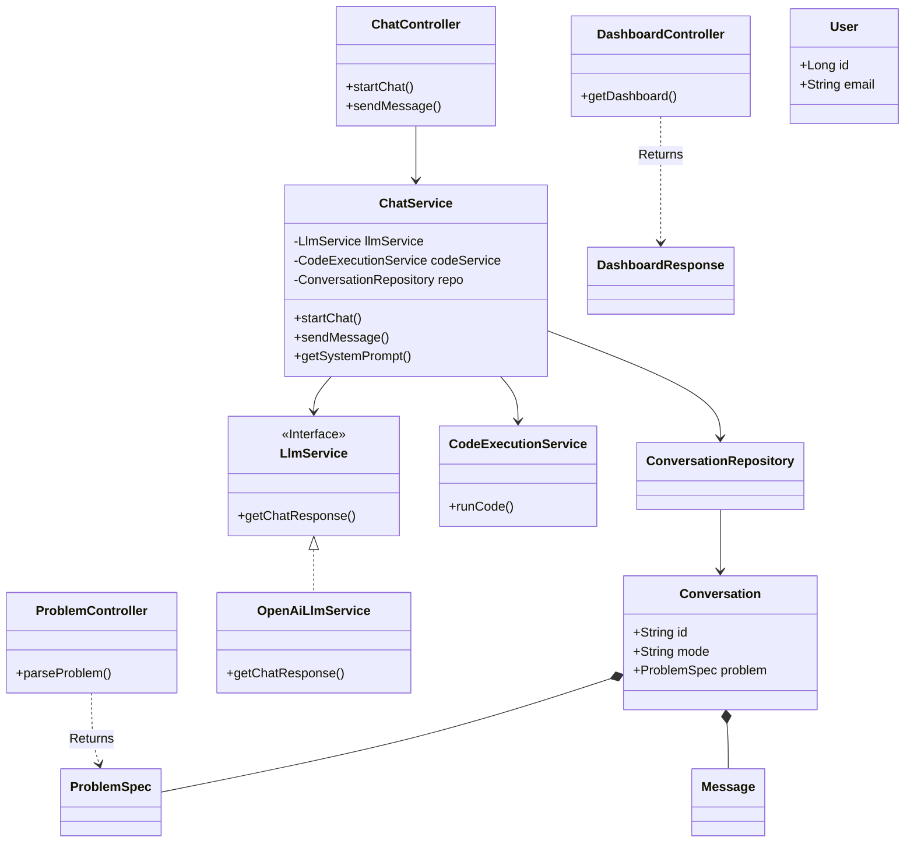
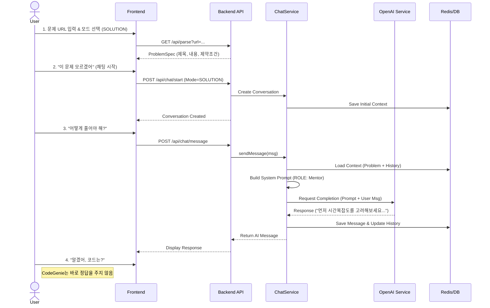

# CodeGenie System Architecture

이 문서는 CodeGenie 프로젝트의 전체 시스템 아키텍처와 데이터 흐름을 시각화합니다.

## 1. High-Level System Architecture

전체 시스템은 **Client-Server** 구조를 따르며, 백엔드는 **Stateless LLM** 원칙을 기반으로 설계되었습니다.

```mermaid
graph TD
    %% Nodes
    User[👤 사용자]
    
    subgraph Client [🎨 프론트엔드 클라이언트]
        Web[🖥️ 웹 앱 (React + Vite)]
        Mobile[📱 모바일 앱 (Capacitor)]
    end
    
    subgraph Server [⚙️ 백엔드 (Spring Boot)]
        API[🚪 API 게이트웨이 / 컨트롤러]
        Service[🧠 비즈니스 로직 / 서비스 계층]
        
        subgraph Core_Services [핵심 서비스]
            ChatSvc[💬 채팅 서비스]
            ProbSvc[🏗️ 문제 서비스]
            DashboardSvc[📊 대시보드 서비스]
            AuthSvc[🔐 인증 서비스]
        end
        
        Repo[💾 리포지토리 계층]
    end
    
    subgraph Infrastructure [🗄️ 인프라]
        DB[(🛢️ RDBMS (Oracle/MySQL))]
        Redis[(⚡ Redis (Session/Context))]
    end
    
    subgraph External [🌍 외부 서비스]
        OpenAI[🤖 OpenAI API (LLM)]
        Baekjoon[algo 백준]
        Programmers[algo 프로그래머스]
    end

    %% Edge connections
    User --> Web
    User --> Mobile
    Web -- HTTPS/JSON --> API
    Mobile -- HTTPS/JSON --> API
    
    API --> Service
    
    Service --> ChatSvc
    Service --> ProbSvc
    Service --> DashboardSvc
    Service --> AuthSvc
    
    ChatSvc -- 프롬프트 생성 --> OpenAI
    ProbSvc -- 크롤링/파싱 --> Baekjoon
    ProbSvc -- 크롤링/파싱 --> Programmers
    
    ChatSvc --> Redis
    Service --> Repo --> DB
```

---

## 2. Backend Component Diagram

백엔드 내부의 주요 컴포넌트 간 의존 관계입니다.



---

## 3. Sequence Diagram: Solution Mode Flow

사용자가 문제 풀이 도움을 요청했을 때의 처리 흐름입니다.


